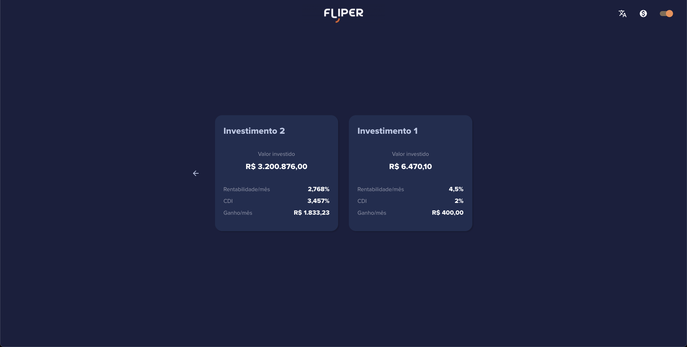

# Fliper App


## Demonstração

<br />
<br />


## Instalação

1. Baixar os arquivos do projeto;
2. Executar  ```yarn``` ;
3. Executar  ```yarn start``` .
4. Acessar a rota ```http://localhost:3000``` no navegador.
## Tecnologias
* [ ] ReactJs
* [ ] GraphQL
* [ ] Typescript
* [ ] Redux
* [ ] Styled Components

